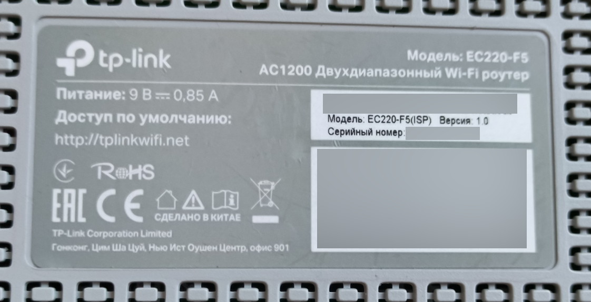
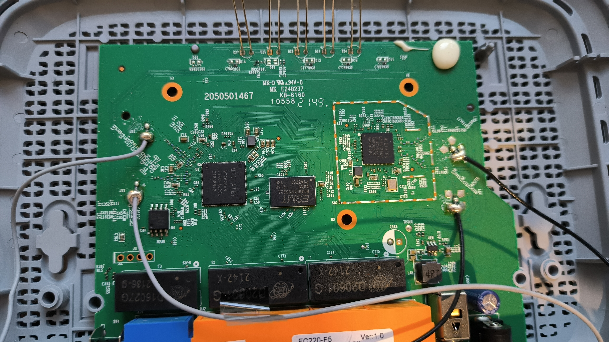
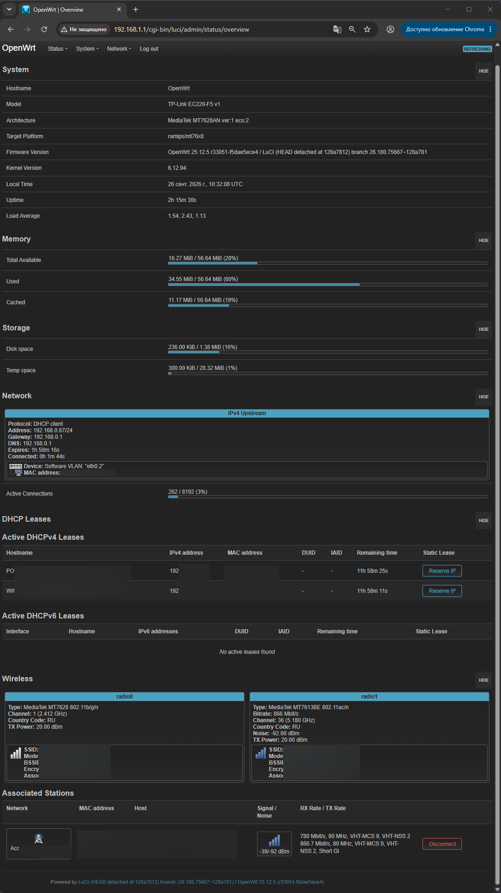
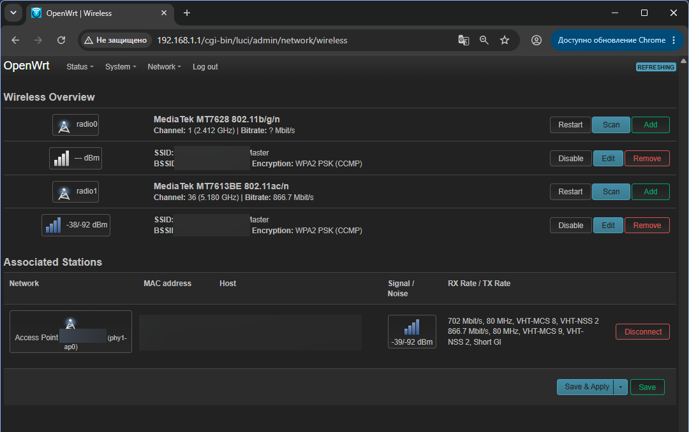
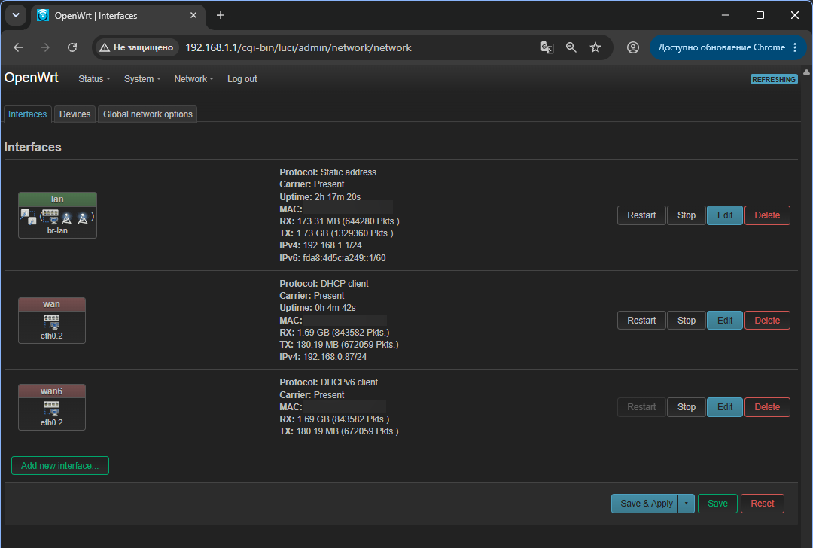
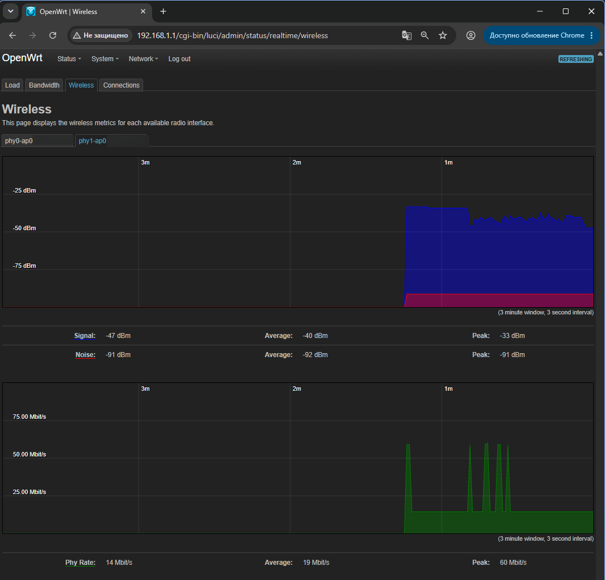
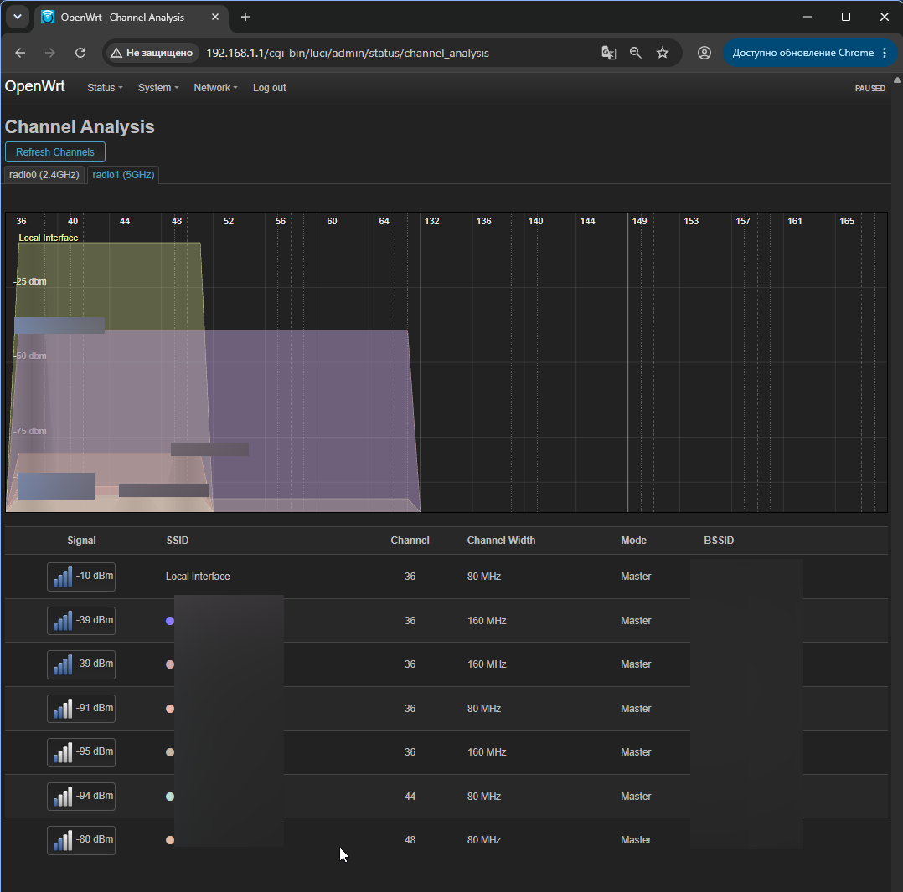

# OpenWrt 25.12.5 for TP-Link EC220-F5 v1

[Русская версия](README.md)

**Documentation:** [recovery](RECOVERY.md) · [hardware](HARDWARE.md) · [source and build notes](SOURCE.md) · [release notes](RELEASE_NOTES.md) · [disclaimer](DISCLAIMER.md)

Unofficial, hardware-validated OpenWrt build for **TP-Link EC220-F5 v1**.

This release was tested on a real EC220-F5 v1 through the full cycle:

**TP-Link stock -> TFTP install -> OpenWrt -> native EC220 sysupgrade -> successful reboot**.

## Important: use at your own risk

This firmware was created **primarily for my own TP-Link EC220-F5 V1**, so that my particular router could run OpenWrt properly. On my unit, TFTP installation, LAN/WAN, 2.4/5 GHz Wi-Fi, 40 MHz SPI and a real follow-up `sysupgrade` were tested successfully.

I **do not guarantee** that it will work on every EC220-F5 unit, another hardware revision, ISP-specific variant, or different component/BOM variant. Flashing is **entirely at your own risk**. You may lose configuration, render the router unbootable, or need TFTP recovery or an external programmer.

This project is provided **AS IS, without warranty of any kind**. I accept no responsibility for damaged hardware, lost configuration/data, or any other consequences resulting from use of these files.

This is not a commercial product and not a supported OpenWrt fork. I built this port for myself and **do not promise future support, bug fixes, new releases, updates, or adaptation for other hardware revisions/models**. If it does not work on your unit, do not assume that I will investigate or maintain it.

Before flashing, keep a stock recovery image and, if possible, back up the device-specific partitions (`boot`, `config`, `rom`, `romfile`, `radio`).

## Tested hardware

- Model: TP-Link EC220-F5
- Hardware version on label: **Version 1.0**
- PCB marking: **2050501467**
- SoC: MediaTek MT7628AN
- RAM: 64 MiB
- SPI NOR: 8 MiB, tested chip **EON EN25QH64**
- 2.4 GHz: MT7628 integrated radio
- 5 GHz: MT7663 over PCIe / mt7615e driver
- Ethernet: 100 Mbit/s

**Do not flash this on EC220-F5 v2, EC220-G5, Archer C50, or any other model/revision.** Other V1 BOM/flash variants have not been tested.

### Photographs of the tested unit

| Device label (unit-specific data redacted) | Main board and PCB marking |
|---|---|
| [](docs/images/ec220-f5-v1-label-redacted.png) | [](docs/images/ec220-f5-v1-pcb.jpg) |

## Release files

### Initial installation / recovery

[`firmware/tp_recovery_EC220-F5_V1_OpenWrt_25.12.5_FINAL.bin`](firmware/tp_recovery_EC220-F5_V1_OpenWrt_25.12.5_FINAL.bin)

- Size: `8126464` bytes (`0x7C0000`)
- SHA256: `aba00e64fa0a668ccd4e2ef80d17916deb043cd3b3af50113e1cd84b9b926076`

Use this file only through the EC220-F5 TFTP recovery path. Rename it to **`tp_recovery.bin`** before starting the TFTP server.

### Normal OpenWrt upgrades

[`firmware/openwrt-25.12.5-ramips-mt76x8-tplink_ec220-f5-v1-squashfs-sysupgrade.bin`](firmware/openwrt-25.12.5-ramips-mt76x8-tplink_ec220-f5-v1-squashfs-sysupgrade.bin)

- Size: `7995643` bytes
- SHA256: `7dd3179b39caa5ef6d3a56e106aecfdfe27bb46a2546bfaa4f07ee7373d38682`

Use this **only after this native EC220-F5 build is already installed**.

## Install from stock with TFTP

1. Keep a stock recovery image before doing anything else. See [`RECOVERY.md`](RECOVERY.md).
2. Connect a PC directly to a LAN port on the router.
3. Set the PC Ethernet adapter to `192.168.0.66/24` (`255.255.255.0`). Gateway and DNS are not required for TFTP.
4. Rename the OpenWrt TFTP image to `tp_recovery.bin` and place it in the TFTP server root.
5. Start the TFTP server on `192.168.0.66`.
6. Power the router off.
7. Hold **RESET**, power the router on while holding RESET, and release when the TFTP transfer starts.
8. The TFTP log should show a request from **`192.168.0.2`** for **`tp_recovery.bin`**.
9. Do not interrupt power. First boot can take around two minutes; give it several minutes before assuming failure.
10. OpenWrt will be available at `192.168.1.1`.

## Upgrade from this build

CLI upgrade is hardware-tested.

```sh
sysupgrade -T /tmp/openwrt-25.12.5-ramips-mt76x8-tplink_ec220-f5-v1-squashfs-sysupgrade.bin
sysupgrade -v /tmp/openwrt-25.12.5-ramips-mt76x8-tplink_ec220-f5-v1-squashfs-sysupgrade.bin
```

The compatibility check must succeed without `-F`.

**Never use `sysupgrade -F`. Never flash an official Archer C50 image on EC220-F5.**

## What is validated

- native `board_name`: `tplink,ec220-f5-v1`
- model string: `TP-Link EC220-F5 v1`
- OpenWrt 25.12.5 / kernel 6.12.94
- 40 MHz SPI NOR clock
- native 8 MiB flash layout
- LAN and WAN
- 2.4 GHz and 5 GHz PHY initialization
- MT7663 firmware loading through the OpenWrt fallback firmware
- TFTP installation/recovery path
- `sysupgrade -T` compatibility validation
- real sysupgrade with successful reboot and preserved native board identity

A log line similar to the following is expected for the 5 GHz radio and is not by itself an error:

```text
mediatek/mt7663pr2h.bin not found, switching to mediatek/mt7663pr2h_rebb.bin
```

## Running-system screenshots

These screenshots were captured on the same hardware unit after installing OpenWrt 25.12.5. Unit-specific network details are redacted.

| System information | Both Wi-Fi bands |
|---|---|
| [](docs/images/luci-overview.png) | [](docs/images/luci-wireless.png) |

<details>
<summary>Additional screenshots: interfaces, Wi-Fi graph and channel analysis</summary>

### LAN and WAN

[](docs/images/luci-interfaces.png)

### Wi-Fi graph

[](docs/images/luci-wireless-graph.png)

### 5 GHz channel analysis

[](docs/images/luci-channel-analysis.png)

</details>

## Important limitations

- This is **not an official OpenWrt-supported device** yet.
- Attended Sysupgrade / Firmware Selector must not be used for device-specific upgrades until the device is upstreamed.
- Full long-term testing across multiple EC220-F5 V1 hardware samples has not been done.
- The published release uses a validated EC220-specific image repack based on OpenWrt 25.12.5. It is not yet generated by a fully upstream-native OpenWrt image profile. See `SOURCE.md`.
- Cold boot is relatively slow (roughly around two minutes on the tested unit).

## Flash layout

| Partition | Offset | Size |
|---|---:|---:|
| boot | `0x000000` | `0x020000` |
| kernel | `0x020000` | `0x210000` |
| rootfs | `0x230000` | `0x590000` |
| config | `0x7C0000` | `0x010000` |
| rom | `0x7D0000` | `0x010000` |
| romfile | `0x7E0000` | `0x010000` |
| radio | `0x7F0000` | `0x010000` |

The OpenWrt install/upgrade images do not overwrite the bootloader or the per-device `config`, `rom`, `romfile`, and `radio` partitions.

## Verify the files

Run:

```sh
python3 tools/verify_release.py
```

Verification script: [`tools/verify_release.py`](tools/verify_release.py).

Alternatively, verify the hashes in [`firmware/SHA256SUMS`](firmware/SHA256SUMS).

## Source / development notes

See [`SOURCE.md`](SOURCE.md) and the [`device/`](device/) directory.
